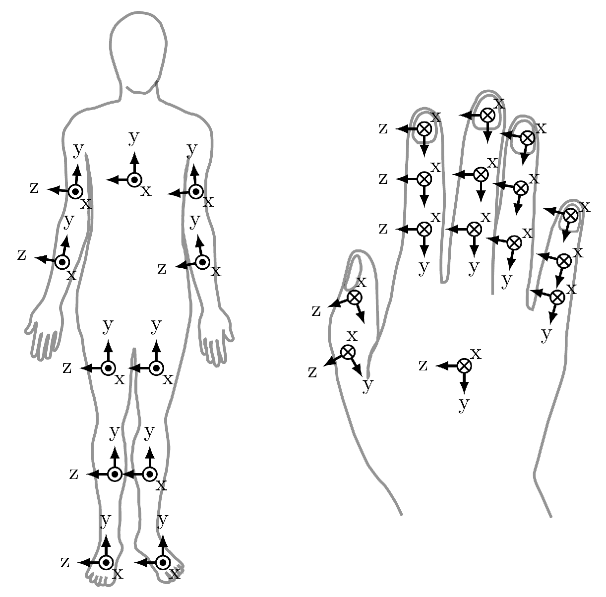

.. SPDX-FileCopyrightText: 2021 Daniel Laidig <laidig@control.tu-berlin.de>
..
.. SPDX-License-Identifier: MIT

.. _coordinate_systems:

Coordinate Systems
##################

This page defines coordinate systems for the reference frame and human body segments. If applicable, they are used
by all data processing functions and visualization tools.

Reference/Earth Frame (ENU)
===========================

For orientations that are expressed using a fixed reference frame, e.g. the output of orientation estimation by 9D
sensor fusion of gyroscope with accelerometer and magnetometer readings, we use an *ENU* (east-north-up) reference frame, i.e.,

- the *z*-axis is pointing up,
- the *y*-axis is pointing north,
- the *x*-axis is pointing east.

When there is no absolute heading defined by the magnetic field, the *x*- and *y*-axes of the reference frame might
point in different directions. Still, we always use a reference frame in which the *z*-axis points up.

Heading Offset
==============

When tracking the relative heading of different orientations, we use the heading offset δ that we define as the rotation
between two reference frames:

.. math::

    {}^{\mathcal{E}_2}_{\mathcal{E}_1}\mathbf{q}(\delta) = \begin{bmatrix}\cos{\frac{\delta}{2}} & 0 & 0 & \sin{\frac{\delta}{2}}\end{bmatrix}^\mathrm{T}

:math:`\mathcal{E}_1` usually refers to the reference frame of the proximal segment and :math:`\mathcal{E}_2` usually
refers to the reference frame of the distal segment.

Body Segments (ISB)
===================

For tracking orientations of human body segments, it is useful to follow a common convention for

1. how the coordinate axes are defined based on anatomical landmarks
2. how relative orientations should be described using joint angles.

We try to follow the recommendations of the International Society of Biomechanics (ISB) as close as possible. The
following section is a simplified summary with a focus on the practical aspects. For further details, take a look at the
original papers:

- Wu, Ge, Frans C. T. van der Helm, H. E. J. (DirkJan) Veeger, Mohsen
  Makhsous, Peter Van Roy, Carolyn Anglin, Jochem Nagels, et al. 2005.
  “ISB Recommendation on Definitions of Joint Coordinate Systems of
  Various Joints for the Reporting of Human Joint MotionPart II: Shoulder,
  Elbow, Wrist and Hand.” *Journal of Biomechanics* 38 (5): 981–92.
  https://doi.org/10.1016/j.jbiomech.2004.05.042.
- Wu, Ge, Sorin Siegler, Paul Allard, Chris Kirtley, Alberto Leardini,
  Dieter Rosenbaum, Mike Whittle, et al. 2002. “ISB Recommendation on
  Definitions of Joint Coordinate System of Various Joints for the
  Reporting of Human Joint MotionPart I: Ankle, Hip, and Spine.” *Journal
  of Biomechanics* 35 (4): 543–48.
  https://doi.org/10.1016/S0021-9290(01)00222-6.

For consistency, we always follow the ISB definition for the right side of the body. For the left side, the coordinate
systems are aligned in the standard anatomical position. For every body segment, the segment coordinate system
(which might be totally different from the IMU coordinate system!) is defined as follows:

.. _fig_isb_segment_coordinate_systems:

  In the standard anatomical position (standing straight, palms facing forward), all segment coordinate systems are
  (roughly) aligned. The x-axes are pointing forward (anterior), the y-axes up (superior, proximal) and the z-axes to
  the right.

This means that -- based on the ENU reference frame -- a human avatar should be standing in the standard anatomical
positions (and looking east) if we set the orientation of all body segments to:

>>> qmt.quatFromAngleAxis(np.deg2rad(90), [1, 0, 0])
array([0.70710678, 0.70710678, 0.        , 0.        ])

Based on those coordinate systems, we can calculate Euler angles of relative segment orientations to get joint angles
(for the right side of the body).

.. admonition:: Ankle Joint

    | z-x'-y'' Euler angles, foot orientation relative to the shank
    | ɸ: dorsiflexion (pos.), plantarflexion (neg.)
    | θ: inversion (pos.), eversion (neg.)
    | ψ: internal rotation (pos.), external rotation (neg.)

.. admonition:: Knee Joint

    | z-x'-y'' Euler angles, shank relative to the thigh
    | ɸ: flexion (pos.), extension (neg.)
    | θ: adduction (pos.), abduction (neg.)
    | ψ: internal rotation (pos.), external rotation (neg.)

.. admonition:: Hip Joint

    | z-x'-y'' Euler angles, thigh relative to the pelvis
    | ɸ: flexion (pos.), extension (neg.)
    | θ: adduction (pos.), abduction (neg.)
    | ψ: internal rotation (pos.), external rotation (neg.)

.. admonition:: Spine

    | z-x'-y'' Euler angles, caudal vertebra relative to cranial vertebra
    | ɸ:flexion (pos.), extension (neg.)
    | θ:lateral bending
    | ψ:axial rotation

.. admonition:: Shoulder

    | y-x'-y'' (!) Euler angles, humerus relative to thorax
    | ɸ: defines plane of elevation (0°: abduction, 90°: forward flexion)
    | θ: elevation (negative)
    | ψ: internal rotation (pos.), external rotation (neg.)

.. admonition:: Elbow Joint (combined humeroulnar and radioulnar joint)

    | z-x'-y'' Euler angles, forearm relative to the humerus
    | ɸ: flexion (pos.), hyperextension (neg.)
    | θ: carrying angle
    | ψ: pronation (pos.), supination (neg.)

.. admonition:: Hand and Wrist

    | z-x'-y'' Euler angles,distal segment relative to proximal segment
    | ɸ: flexion (pos.), extension (neg.)
    | θ: adduction/ulnar deviation (pos.), abduction/radial deviation (neg.)
    | ψ: pronation (pos.), supination (neg.)
