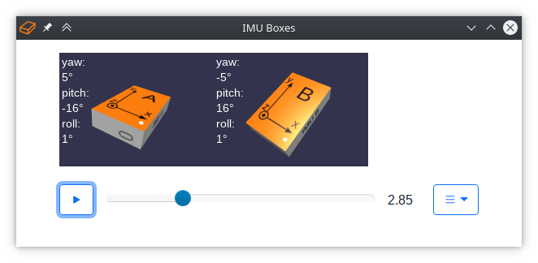
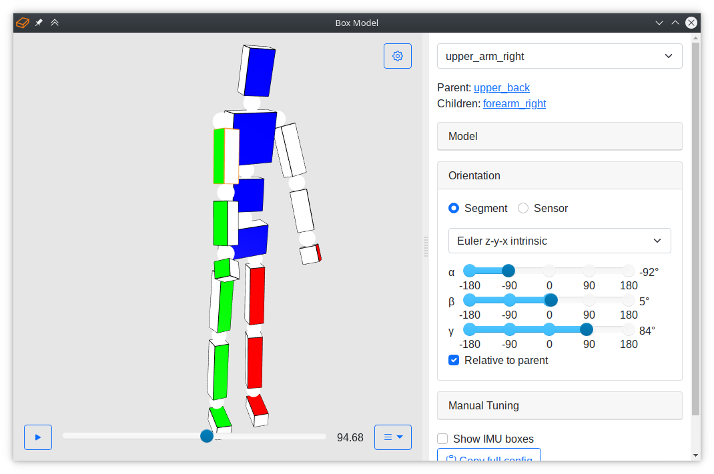
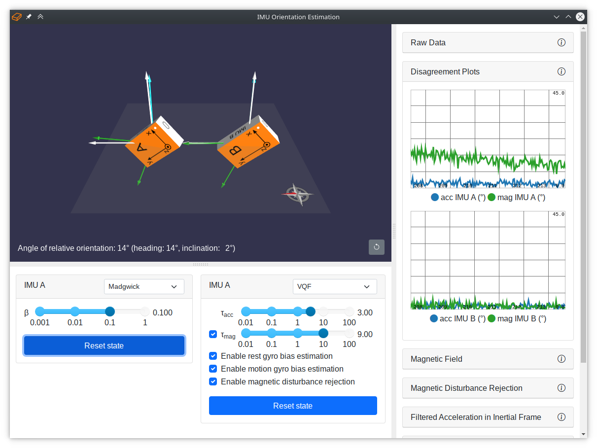
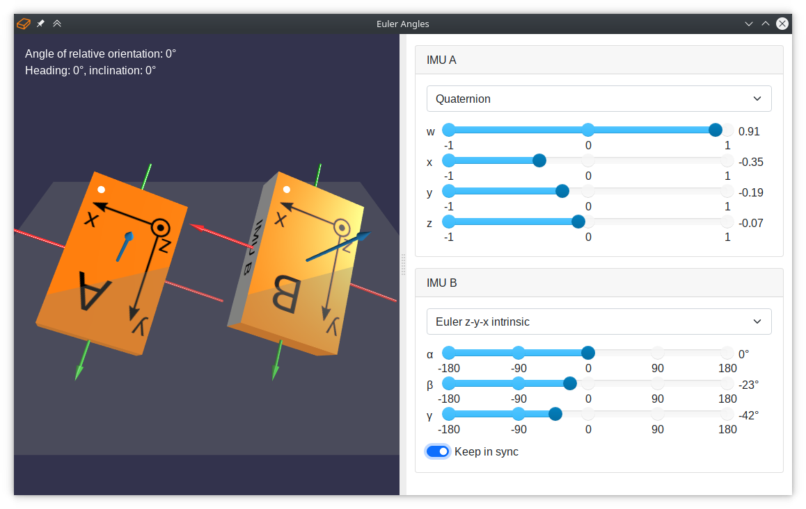
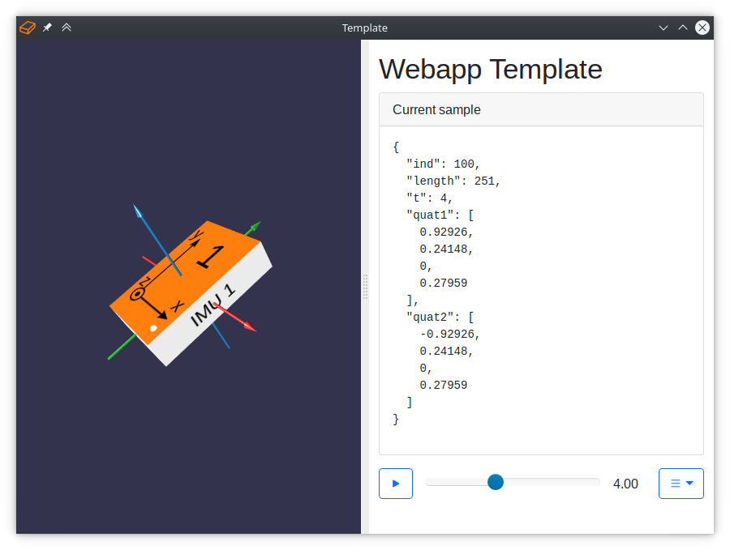
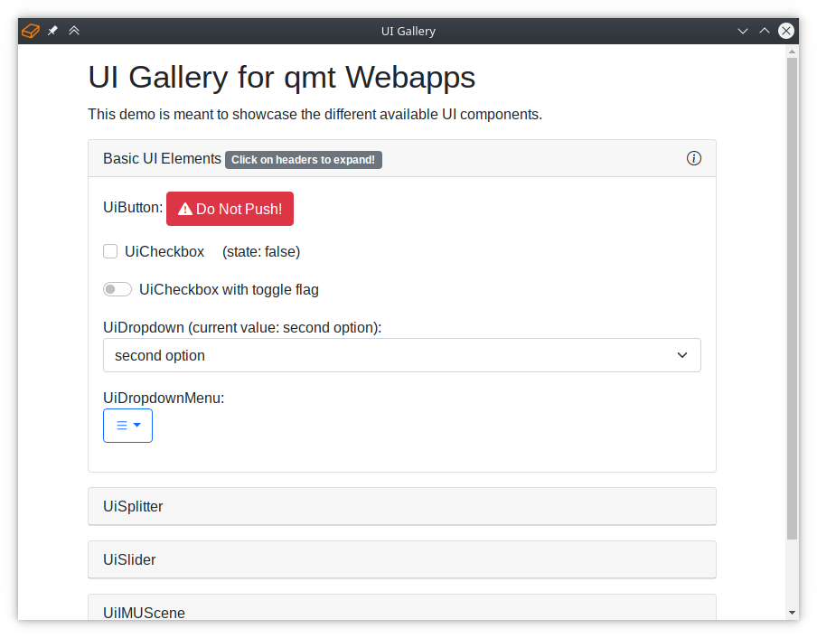

.. SPDX-FileCopyrightText: 2021 Daniel Laidig <laidig@control.tu-berlin.de>
.. SPDX-FileCopyrightText: 2021 Bo Yang <b.yang@campus.tu-berlin.de>
..
.. SPDX-License-Identifier: MIT

.. _ref_webapps:

Webapps
#######

Webapps can be used from Python code with the :class:`qmt.Webapp` class and with the ``qmt-webapp`` command-line tool.
This page gives an overview of the included webapps. See :ref:`dev_webapps` for information on how to create custom
webapps.

The included webapps are available under the special paths ``/view/`` for generic data visualization webapps and
``/demo/`` for single-purpose demo apps.

IMU Boxes (/view/imubox)
========================

Visualizes quaternions as IMU boxes. The number of IMUs, names of quaternion signals, and other options can be specified
using the config::

    config = {
        "imus": [
            {"signal": "quat1", "letter": "A"},
            {"signal": "quat2", "letter": "B", "cs": "FLU", "axes": True},
        ]
    }

If no config is set, IMUs are created based on signals with the name 'quat', followed by a single character, in the
first sample.

See the examples ``webapp_example_script.py`` and ``webapp_example_notebook.ipynb`` for various examples that use this
webapp.

Generic Kinematic Chain Box Model (/view/boxmodel)
==================================================

Visualizes movements of a kinematic chain as a model of boxes (and spheres at the joints). A predefined human body model
can be used, or a custom model can be specified via the config.
To use the pre-defined human model, create a config to tell the visualization which quaternions to apply to which body
segment and optionally override any other properties::

    config = {
        "base": "human",
        "segments": {
                "foot_left": {"signal": "foot_left.quat", "color": "red"},
                "foot_right": {"signal": "foot_right.quat", "color": "blue"},
                 ...
             },
        }

The following configuration options are available:

- ``base``: Template to use. Currently, the only available template is ``human``. The 16 body segments are: hip,
  upper_leg_left, lower_leg_left, foot_left, upper_leg_right, lower_leg_right, foot_right, lower_back, upper_back,
  upper_arm_left, forearm_left, hand_left, upper_arm_right, forearm_right, hand_right, and head.
  If no ``base`` is given, a custom kinematic chain has to be specified via the ``segments`` option.
- ``segments``: Defined the segments of the kinematic chain. If a ``base`` template is used, each entry in in
  ``segments`` will overwrite the corresponding items in the template.
- ``defaults``: Default segment properties.
- ``debug_mode``: Opens right sidebar with debug controls if set to true (default: false).

The following properties in ``segments`` are used to define a kinematic chain. If they are not given, default values
are used.

* ``parent``: The name of the parent segment which current the segment connected to. At least one segment needs to have
  ``root`` as the parent segment.
* ``signal``: The name of the quaternion signal that defines the segment orientation, default: null/None.
* ``quat``: Initial/default segment orientation quaternion, default: [1 0 0 0].
* ``heading_offset``: Heading offset in degrees that was applied to the segment. This value is used as the initial value
  for the manual tuning slider. It is expected that the offset is already applied to the segment, default: null.
* ``relative``: Defines if orientation is relative to the parent segment, default: false.
* ``dimensions``: 3D vector defining the size of the segment box, default: [0 0 0].
* ``sphere``: Diameter of the joint sphere, default: 3 (set to 0 to hide sphere).
* ``origin_rel``: Origin of the local coordinate system (i.e., the center of the joint sphere), as a 3D vector starting
  from the center of the segment box, relative to the segment's dimensions, default: [0 0 0].
* ``origin_abs``: Origin of the local coordinate system (i.e., the center of the joint sphere), as a 3D vector starting
  from the center of the segment box, in absolute sizes, default: [0 0 0]. Absolute and relative sizes are added up,
  i.e., ``origin = dimensions*origin_rel + origin_abs``.
* ``position_rel``: Position of the local coordinate system (i.e., the center of the joint sphere) in the parent's
  coordinate system, relative to the parent's dimensions, default: [0 0 0].
* ``position_abs``: Position of the local coordinate system (i.e., the center of the joint sphere) in the parent's
  coordinate system, in absolute sizes, default: [0 0 0]. Absolute and relative sizes are added up,
  i.e., ``position = parent_dimensions*position_rel + position_abs``.
* ``scale``: Scaling factor for all sizes, default: 1.0.
* ``color``: The color of the box, default: red.
* ``face``: Integer from 0 to 5 that describes which face of the box to color, default: 4.
* ``edges``: Defines if edges of the box should be rendered, default: true.
* ``opacity``: Opacity of the box from 0 to 1, default: 1.
* ``q_segment2sensor``: Sensor-to-segment orientation quaternion for IMU boxes, default: null/None.
* ``imubox_show``: Enables showing of small IMU boxes if q_segment2sensor is defined, default: true.
* ``imubox_scale``: Scaling factor of the IMU box, default: 0.6.
* ``imubox_cs``: Coordinate system of the IMU (see the IMUBox class), default: 'RFU'.
* ``imubox_distance_rel``: Distance of the IMU box from the segment box center (relative to segment dimensions),
  default: 1.05.
* ``imubox_distance_abs``: Distance of the IMU box from the segment box center (absolute), default: 1.

The following example configuration defines a kinematic chain with 2 segments, consisting of forearm and hand::

    config = {
        "segments": {
            "forearm": {
                "parent": "root",
                "signal": "q_forearm_seg",
                "dimensions": [4, 25, 7],
                "origin_rel": [0, 0.5, 0],
                "color": "C0",
                "face": 3,
            },
            "hand": {
                "parent": "forearm",
                "signal": "q_hand_seg",
                "dimensions": [3, 12, 9],
                "position_rel": [0, -1, 0],
                "position_abs": [0, -1.5, 0],
                "origin_rel": [0, 0.5, 0],
                "origin_abs": [0, 1.5, 0],
                "color": "C1",
                "face": 3,
            },
        }
    }

The example above follows the :ref:`ISB coordinate system conventions<fig_isb_segment_coordinate_systems>`. The origin
of the forearm coordinate system is the elbow joint center, which is in positive y-direction. From the box center, this
means that we have to specify a relative origin vector of ``[0, 0.5, 0]``. For the hand, we have to add an absolute
distance of 1.5, i.e., half of the joint sphere diameter, to the origin vector. In forearm coordinates, the wrist joint
center (i.e., the position of the hand coordinate system) is in negative y-direction. From the forearm origin, the
distance is the length of the forearm box (-1 as ``position_rel``) plus half of the diameter of the joint sphere
(-1.5 as ``position_abs``). For another example, see how the human template is specified in the file ``boxmodel.json``
in the `assets <https://github.com/dlaidig/qmt/tree/main/qmt/webapps/lib-qmt/assets>`__ folder.

Full Body Motion Tracking Demo (/demo/full-body-tracking)
=========================================================

This demo extends the functionality of the box model viewer by additional features and controls for a full body motion
tracking demo. See the script ``full_body_tracking_demo.py`` in the examples/ directory.

IMU Raw Data Demo (/demo/imu-raw-data)
======================================

.. image:: images/webapp-demo-imu-raw-data.png
  :alt: screenshot of imu-raw-data webapp

Real-time visualization of raw IMU measurements, i.e., gyroscope, accelerometer, and magnetometer measurements, both as
line plots and as 3D arrows. This demo can be used to explain what IMUs measure. To run it with generated IMU data, run:

.. code-block:: sh

    qmt-webapp --datasource '{"class": "qmt.DummyImuDataSource", "Ts": 0.04}' /demo/imu-raw-data

Orientation Estimation Demo (/demo/orientation-estimation)
==========================================================

Real-time comparison of different IMU orientation estimation algorithms. Two algorithms can be run side-by-side, and
parameters can be adjusted on the fly. The right sidebar shows various plots to gain insight into the behavior of the
algorithms. To run the demo, execute the Python script ``orientation_estimation_demo.py`` in the
`examples/ <https://github.com/dlaidig/qmt/tree/main/examples>`__ folder of the repository.

By default, the :class:`qmt.DummyImuDataSource` is used to generate some fake IMU data as input for the algorithms. To
connect this demo with a real IMU, implement a compatible :class:`qmt.AbstractDataSource` and configure the demo to use
your custom data source:

.. code-block:: sh

    ./orientation_estimation_demo.py '{"class": "my_module.MyImuDataSource", "device": "6fb3fe"}'

Euler Angles Demo Tool (/demo/euler-angles)
===========================================

Tool for exploring quaternions and different Euler angle conventions to represent orientions. Two boxes are displayed
and the orientation can be set via sliders in different representation.

Webapp Template (/demo/template)
================================

This webapp serves as a simple starting point that can be copied to create a custom webapp. The right side shows the
last received sample as JSON text, which can also be useful for testing purposes.

UI Element Gallery (/demo/ui-gallery)
=====================================

The UI gallery includes many user interface elements available in ``lib-qmt.js`` and provides a quick overview of what
is available for building custom webapps.

